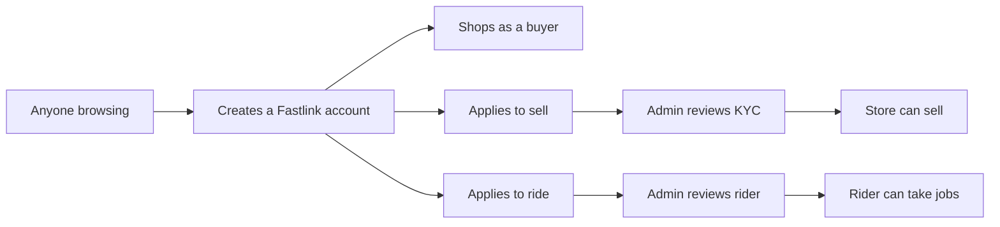
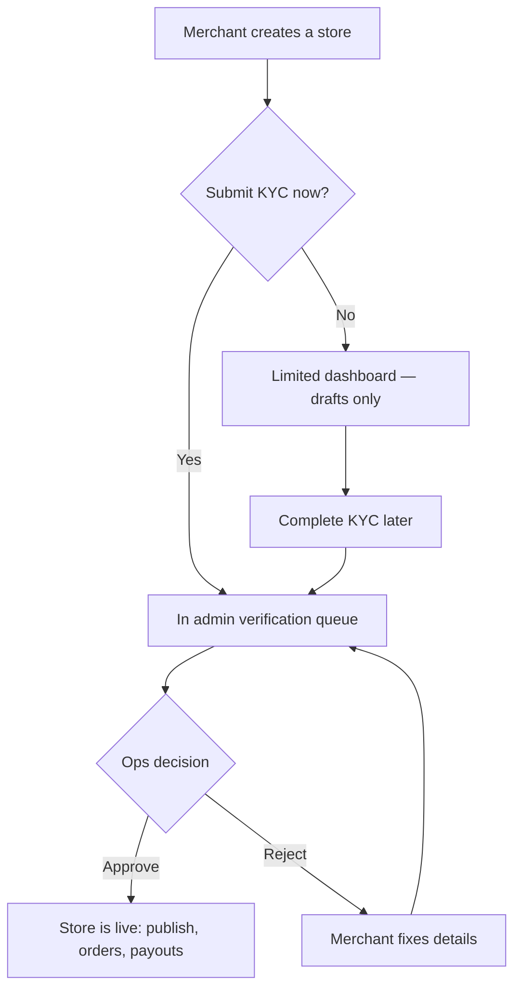
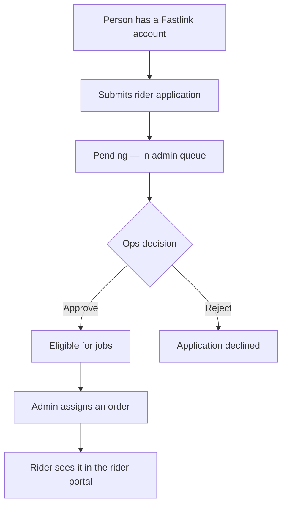

# Fastlink onboarding — briefing for project management

**Audience:** Project manager / ops / stakeholders  
**Status:** How the live product works today (not a proposal)  
**Date:** 18 August 2026  
**Owner:** Engineering

This note explains how a person becomes a **buyer**, a **seller**, or a **rider** on Fastlink, what they can do at each step, and where **admin review** is required. You can share it as-is.

---

## 1. In one page

Fastlink is one marketplace with three customer types. Everyone starts with a Fastlink account (email and password). Admins cannot self-register; they are created internally.

| Who | Goal | Time to first useful access | Admin needed? |
|-----|------|-----------------------------|---------------|
| **Buyer** | Shop and pay | Immediate after signup | No |
| **Seller** | Open a store and sell | Dashboard immediately; **selling only after KYC approval** | Yes, to go live |
| **Rider** | Deliver orders | Portal immediately; **jobs only after approval + assignment** | Yes, to go live |

**The most important product rule:** signing up is not the same as being verified.

- A seller can create a store, log into the dashboard, and draft products **before** KYC.
- They **cannot** publish listings, take customer orders, or request payouts until an admin approves verification.
- A rider can submit an application and open the rider portal, but they **will not receive deliveries** until an admin approves them and assigns an order.

Guests can browse and add to cart. They **must log in or register to check out**.

---

## 2. What this means for launch and ops

1. **Buyers scale without ops.** There is no manual approval to shop.
2. **Sellers and riders create an ops queue.** Every KYC submission and every rider application lands in **Admin → Verification**. Until someone reviews it, the applicant is stuck in a limited state.
3. **We should agree an SLA** (for example: review KYC within 24–48 hours). The product does not auto-approve in production.
4. **One person, one role.** A user is a buyer, *or* a seller, *or* a rider — not two at once. Converting from buyer to seller (or rider) replaces their role.
5. **Sellers can prepare while they wait.** That is intentional: they stay engaged instead of sitting on a blank “pending” screen.

---

## 3. Buyer onboarding

### What we want them to feel

“I signed up and I can buy in the same session.” There is no document upload and no waiting period.

### How they arrive

- **Create account** on the Sign up page (leave “I want to sell on Fastlink” unchecked).
- **Log in** if they already have an account.
- **Start checkout while logged out** — they are sent to login, then returned to checkout.
- **Referral link** — if they register with a valid referral code, the referrer gets credit.

### Step by step

1. Enter username, email, password (min 8 characters), and optional referral code.
2. Submit. They are taken to **My Account**.
3. They can immediately use orders, addresses, wishlist, messages, notifications, referrals, rewards, and profile.
4. Profile extras (phone, photo, saved addresses) are optional. Nothing blocks shopping if those are empty.

### First purchase (this is the real “activation”)

1. Browse the homepage, products, or malls.
2. Add items to cart.
3. Checkout: **Contact → Shipping → Payment → Review**.
4. If they have no saved address, checkout collects one and calculates delivery by location.
5. They pay (Paystack when configured; otherwise a demo payment in non-production).
6. The order appears under **My Account → Orders**. They can also track with order ID + email without logging in.

**Loyalty (already live)**

- Earn **1 point per ₦100** paid.
- Redeem **1 point = ₦1**, up to **50%** of the cart after a promo.

### After signup, buyers can

| Area | What they do |
|------|----------------|
| My Account | Overview and shortcuts |
| Profile | Name, phone, photo |
| Addresses | Delivery addresses |
| Orders | Track purchases and request returns |
| Messages | Chat with a seller |
| Notifications | Order and account alerts |
| Referrals | Share their code |
| Rewards | See loyalty points |
| Wishlist | Save products |

### Buyers cannot

- Open the seller dashboard or admin control tower.
- Publish a store without the seller wizard and KYC approval.
- Become a rider without submitting the rider application.

They **can** convert later from the homepage: **Sell on Fastlink** or **Ride with Us**. They do not create a second account.

---

## 4. Seller onboarding

### Product intent

Get merchants into the dashboard quickly so they can set up a store, then **gate money and live listings** until we verify the business.

Think of two unlocks:

| Unlock | When | What they get |
|--------|------|----------------|
| **Store created** | After the wizard (KYC can be skipped) | Limited dashboard, draft products, settings |
| **Verified (`can sell`)** | Admin approves KYC | Live listings, customer orders, payouts |

### How they arrive

- Sign up and tick **“I want to sell on Fastlink (Merchant)”**.
- Or an existing buyer clicks **Sell on Fastlink**.
- If they are logged out, we send them to sign up first, then into the store wizard.

If they are already fully verified, we tell them and send them to the dashboard.

### The store wizard (4 steps)

**Step 1 — Store type**

| Type | Meaning |
|------|---------|
| Mall store | Shop inside a Fastlink mall (they must pick which mall) |
| Independent | Standalone local shop |
| Nationwide | Ships across the country |
| Emerging brand | New or growing brand |

**Step 2 — Business details**

Required: store name, business phone.  
Optional: address, primary category, short description.

**Step 3 — KYC (can skip)**

To **submit for review** they must enter settlement bank details:

- Bank name
- 10-digit NUBAN account number
- Account name

They may optionally upload (PDF or image, max 8MB):

- CAC certificate
- Government-issued ID

Skipping KYC is allowed. They can finish it later from the dashboard.

**Step 4 — Review**

Two choices:

| Choice | Result |
|--------|--------|
| **Create store draft** | Store exists. They can use the dashboard. They still cannot sell. |
| **Submit KYC for verification** | Bank details required. Application goes to the admin queue. Seller is told it is under review. |

### What the limited dashboard allows (before approval)

- Log in to the seller dashboard
- Edit store settings
- Create and edit **draft** products
- See a banner: complete KYC / under review / rejected

### What stays locked until admin approval

- Publishing products so buyers can see and buy them
- Receiving live checkouts
- Requesting payouts

If they try to publish early, the product explains that verification is required and points them back to KYC.

### After they submit KYC

They see a **pending / under review** screen. Copy is clear: they can keep drafting; live selling is locked; they will be notified.

If we **reject**, they see the reason and a **Fix KYC** path. They can update details and resubmit (the application goes back into the queue).

### Verification statuses (seller)

| Status | Meaning for the merchant |
|--------|---------------------------|
| Not started | Store exists; they have not submitted KYC |
| In progress | They started bank/docs but have not submitted |
| Under review | Waiting on ops |
| Approved | They can sell |
| Rejected | They must fix and resubmit |

### Ops actions (seller)

In **Admin → Verification**:

- Review owner, bank account, and uploaded documents.
- **Approve** — store can sell; seller is notified. You can attach them to a mall if needed.
- **Reject** (with a reason) — seller is notified and can try again.

**One store per owner.** A second application from the same account is not allowed.

---

## 5. Rider onboarding

### Product intent

Couriers apply with a short form. Ops vets them. Only approved riders can be assigned deliveries.

### How they arrive

- Homepage **Ride with Us**.
- If logged out, they create an account first, then fill the rider form.
- If they are already a rider, they go straight to the rider portal.

### The application (one screen)

Required on the form:

- Phone number
- Vehicle type: motorcycle/bike, car/sedan, or van/truck
- Operating city (e.g. Lagos, Abuja, Port Harcourt)

There is **no bank KYC** and **no document upload on this screen**. (The system can store rider documents in the background, but the public form does not collect ID, licence, or vehicle papers yet. See §8.)

### After they submit

- Their account becomes a **rider** account.
- Application status is **pending**.
- Admins are notified.
- They can open the **rider portal**. It will usually show “no deliveries assigned yet” until ops approves and assigns work.

### Ops actions (rider)

In **Admin → Verification** and **Admin → Riders**:

| Action | Result |
|--------|--------|
| **Approve** | Rider can be assigned orders; they get a notification |
| **Reject** (optional reason) | They are notified; they will not get new jobs |
| **Assign rider to an order** | Only works if the rider is already approved |

---

## 6. Side-by-side

| | Buyer | Seller | Rider |
|--|-------|--------|-------|
| Signup | Default | Tick “sell on Fastlink”, or convert later | Convert after account exists |
| Extra setup | None | 4-step store wizard | Short courier form |
| Documents | None | CAC + ID optional; bank required to submit KYC | Not collected on the public form yet |
| Where they land | My Account | Seller dashboard | Rider portal |
| Need admin to use the basics? | No | No (dashboard + drafts) | Portal yes; jobs no |
| Need admin to make money / take work? | N/A (they pay us) | Yes — to sell and get paid | Yes — to receive deliveries |
| Can browse the shop? | Yes | Yes (public site) | Public site still works; they are no longer a buyer-role account |

---

## 7. Notifications (so nobody is left guessing)

| Event | Who is told |
|-------|-------------|
| Seller submits KYC | Admins |
| Seller approved or rejected | The seller |
| Rider applies | Admins |
| Rider approved or rejected | The rider |
| Seller still unverified | Persistent banner on their dashboard |

Sellers should not need to email support to learn they were rejected; the reason is shown in product.

---

## 8. Known constraints (flag these)

These are current product facts, not bugs unless you want them treated as launch blockers.

| Item | Impact | Suggestion |
|------|--------|------------|
| **One role per user** | A seller who also wants to ride (or the reverse) cannot hold both roles on the same login | Confirm this is acceptable for v1, or add dual-role later |
| **Rider docs not in the UI** | Ops may approve riders with only phone, vehicle, and city | Decide if ID/licence upload is required before we market “Ride with Us” |
| **KYC documents are optional** | A seller can submit with bank details only, no CAC/ID | Decide if ops will reject incomplete packs, or make files required in the wizard |
| **Skipped KYC is allowed** | Merchants can sit in “not started” indefinitely | Consider reminders or a deadline if we want a cleaner pipeline |
| **No auto-approve in production** | Every seller and rider needs a human | Staff the verification queue; agree an SLA |
| **Staff on a store must register first** | Owner cannot invite an email that has no Fastlink account | Include in seller help copy |
| **Document upload can fail silently in the wizard** | Store still creates; files can be added later | Ops should check that documents actually arrived before approving |

---

## 9. Demo script (for a walkthrough)

Use a **new email** each time (not the seeded demo users) so you see the real pending states.

### A. Buyer (5 minutes)

1. Open Sign up. Do not tick merchant.
2. Confirm you land on **My Account**.
3. Add a product to cart → checkout (you will be asked to log in if you skipped that).
4. Place an order. Confirm it under **Orders**.

### B. Seller (10 minutes + ops)

1. Sign up with **I want to sell on Fastlink**.
2. Walk the wizard: pick store type → name and phone → skip or fill KYC.
3. Open the dashboard. Confirm the verification banner.
4. Create a **draft** product. Try to publish — it should stay blocked.
5. Submit KYC (if you skipped it).
6. As admin, open **Verification**, approve the store.
7. As seller, publish the product. Confirm payouts are now allowed.

### C. Rider (5 minutes + ops)

1. Sign up as a normal user (or use a fresh buyer).
2. **Ride with Us** → phone, vehicle, city → submit.
3. Open the rider portal — empty list is expected.
4. As admin, approve the rider, then assign an order.
5. Confirm the order appears in the rider portal.

---

## 10. Decisions to confirm

Please reply with a yes/no or a rule on each:

1. **SLA** — How fast should ops approve or reject seller KYC and rider applications?
2. **Seller documents** — Must CAC and/or ID be mandatory before submit, or is bank-only acceptable?
3. **Rider vetting** — Is phone + vehicle + city enough for v1, or do we block launch of rider signup until ID/licence upload is in the form?
4. **Dual role** — Is “seller or rider, not both” acceptable for launch messaging?
5. **Skip KYC** — Keep “create draft and verify later”, or force KYC before the dashboard?

---

## 11. Summary for stakeholders

- **Buyers** onboard in one form and can purchase immediately after login.
- **Sellers** onboard in a four-step wizard. They get a useful but **limited** dashboard until KYC is approved. Live selling and payouts are the admin gate.
- **Riders** onboard in a short application. The portal is visible while pending; **jobs are the admin gate**.
- **Ops owns the bottleneck.** Without a staffed verification queue, sellers and riders will look “stuck” even though the product is working as designed.

If you want this turned into a one-pager for merchants/riders (help centre copy) or a checklist for the ops team, say which audience and we will split it.
